# Week 1 - January 22, 2026

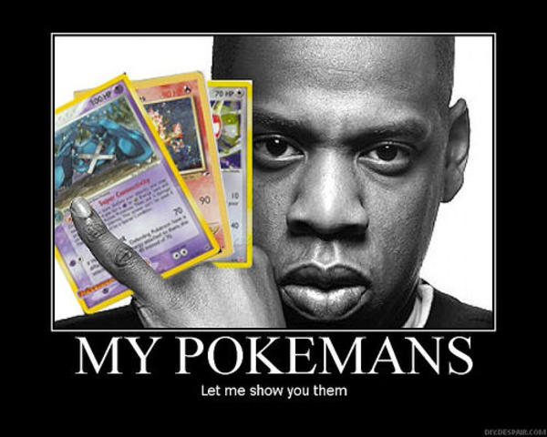

## Make a Thing - KEEP PLAYING AND NOBODY EXPLODES

In this game, you have one simple goal: prevent the timer from reaching 0. If you do, the bomb explodes and it's game over.

However, there's one small caviat: there are multiple microgames on the bomb, ranging from valves that exhaust steam unless you close them to aligning cards, all of which prevents you from pressing the button to stop the detonation. You have to manage your resources and time, going through all the noise and struggle to concentrate and reset the timer by pressing the button, to keep playing so that nobody explodes.

## Process

### Day 1:
I knew I wanted to make some kind of management game as my first endeavor with a prototype, especially one with multiple little games so I could complete a few and see how they work. My central idea for this came from a game I hold dear to my heart: Keep Talking and Nobody Explodes, which I played religiously with a buddy of mine when we were both pre-teens. I sketched out a couple ideas for puzzles I knew I wanted to implement, including a number pad that would have a combination you'd have to answer to defuse it and a certain number you had to reach, only you could increment by +1 or +10 to achieve it. I knew what I wanted, but now became the goal of implementing it.

I quickly started by sketching out a grid of 400x400 squares where everything would be, with the button at the bottom right as a constant reminder. One big thing I wanted was custom sketch art, specifically of the bomb, to demonstrate its importance. The sketch was relatively easy as-is:

Now that that was done, it got late, so I decided to keep it for another day.

### Day 2

I used this as my primary code and first trap day. I coded in a simple countdown for the timer, and then coded a way for you to interact with the button to reset it, creating an infinite loop, exactly what I wanted.

Next, I set up systems that would prevent it from going off if any boolean in an object were false, which is where all my traps would go. With that set up, I started on my first trap: a numberpad Trap.

I got back on the pixel art editor and coded it in 3 parts: the buttons, the numbers, and the combination of the two being the padlock:

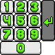

I coded together each end-case, where each button would be pressed, since I believed that coding them individually would take longer. I got each sprite imported into the project, fitted it correctly using some simple math to divide the board into its individual cubes, and worked on the logic to click on them. Once the hitboxes were all fully finished, I quickly coded a "correct combination", a randomly-generated 5 digit code, and coded together the way to "solve" it by splitting it into its individual numbers and checking them off once each one was correct, with it resetting if you got it wrong and turning off if you got it right.

A pattern began to emerge for the event system, that being when the trap would commence, what would happen when it did, and how to disable it. I carried this over with me for all the rest of the traps.

Finally, to end the day, I started to draw out the rest of the pixel art, such as buttons for another microgame:

### Day 3

This is where I did 3 other traps to round things off. I knew I wanted one involving mouse movement, one involving mathematics, and another involving patterns, since I already did the one for memory.

#### Next traps
The first one I tackled was the mouse movement. From the start, I wanted some kind of valve to release steam, where you'd have to physically rotate the mouse a certain way to stop it.

#### Valve Trap
This involved tinkering. I first coded an easy rectangle for the valve and reused my particle system from another game, changing their values and rendering it as "steam". Afterwards, I reused previous code to activate and dispell the trap, matching it to the boolean object that prevents the button from being pressed.

#### Valve Rotation
Afterwards came the hardest part of the game: figuring out the rotations. Rotating the rectangle itself was fine, finding the central area and, after clicking, moving the rectangle to rotate along with wherever the mouse was. However, it was counting those rotations that became quite difficult. The current math I have going on would take a while to explain, mainly involving sin waves, constrains, atan2, and other portions, but once that was finished, it was able to detect a certain amount of rotations. All that was left was to code an "end" amount of rotations that triggered the endEvent, coding a "correct" rotation, whether clockwise or counterclockwise, and then finalizing it with some fun sound effects so the player would know where to go.

#### Exact Trap
The next one was very easy to do: the exact trap. I simply grabbed two rectangles, coded two numbers into them, that being your present value and the desired value, and coded each button to add or subtract 1 or 10 from the present value by reusing previous code for the buttons before. After that, it was only a matter of checking if the values matched whenever the buttons were pressed and stopping the trap when they did. Nothing too special here minus some funny sound effects.

#### Deck Trap
Finally, for the memory matching game, I crafted various cards with various distinct shapes onto them to make it easier at a glance:

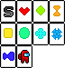

Afterwards, I then decided to be a bit special and code a custom class for a card, complete with its name, its value (sprite), whether it was face up or down, and whether it was solved. Go through each card in a for loop, spawn two of them, and then display them in a nested for loop in a 4x4 radius. Once that was done, it was a matter of "saving" what card was read, comparing it with another card chosen, flipping them both back up if you were wrong and keeping them both down when you were right. Once they were all down, the trap would disarm.

With that, I experimented and played with the game to test how fun it was, and it turned out to be a very nice experience overall with the game! The last day would be mostly polishing.

### Day 4
Today was mostly polishing details out.

#### Distinct sounds
I wanted each trap to have its own distinct sound, so the user would know what was active when. I got a realistic card shuffle sound for the deck trap, Microsoft SAM to voice out the numberPad trap, realistic steam noises for the valve trap (alongside its visuals), and a deeper Mortal Kombat "Test your Might" voice for the exact trap. After implementing different types of fun sounds for interactivity and immersion (a valve turning, retro sounds for picking cards, Microsoft SAM voicing each number you dialed, and pass/fail sounds for each), I knew what I wanted last was music. I decided to go with Carnival Night Zone Act 1 from Sonic 3 Prototype:

https://www.youtube.com/watch?v=Be3B-_ZrGu8

I figured it would be a nice touch.

#### Game Over

However, one thing my game lacked and desperately needed to be complete was a complete game loop, meaning a game over. I coded a flashing red sound for a "bomb explosion" and got the mine explosion sound from Minesweeper Plus by Jorel, as well as coding 10 different "game over" lines in Microsoft SAM that would be spoken, all combining together as the player "reacting" to losing, before the bomb explodes. I quickly coded together a "total elapsed time" to show how long they lasted, with spacebar then being coded to completely reset and restart the game, thus tying the gameplay loop together!

### Future plans

I already have a lot on my plate, so I doubt I'll be re-exploring this, but if I did, I would love to try getting "true randomness" on when the traps would arm, allowing for less of a "they all activate near all at once" and more of "you have to properly manage things". Additionally, I would add other traps, with each reload having them be at a random place, maybe 10 ish traps that would alternate so you would have 4-5 traps each. Finally, I would likely add a difficulty setting, that would allow for more tense gameplay being rewarded with more points or something.

To be honest, this was taking a lot of space in my head, and I really wanted to use this as an opportunity to get it out in terms of a "prototype". I'm quite proud with what I've done over the course of not even 4 days, and proud that I got to make some cool and custom sprite art, as well as experiment with a "Wario-Ware" kinda microgame mechanic, alongside me and my friends having fun playing it overall.

# Week 2 - January 29, 2026

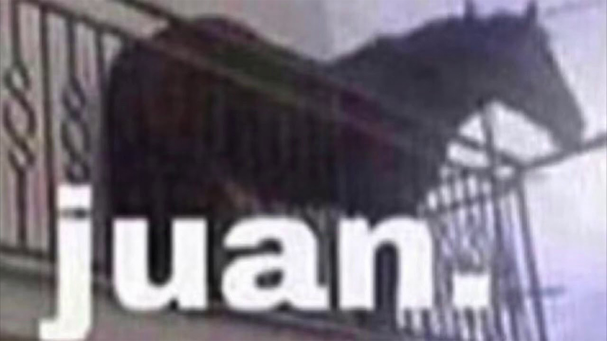

## Goofing around in Unity

For this week, I mostly messed around in Unity, checking out some various tutorials, notably checking out a game made by a friend of mine.

Unity had a built-in tutorial that I followed to the best of my abilities, quickly getting the hang of some various portions (when it decided to actually work).

First thing in Unity was a character that already moved, so we got familiar with character movement and creation, alongside speed change, and interactivity with certain objects in the map. All these were adjustible.

Next tutorial was asset management, taking certain assets and transferring them to empty scenes, understanding object sizing. We were told to make a new object, in this case a ball, and modified its colliding sturctures (with a ramp) and bounciness with certain values, understanding how to create values in unity ourselves (changing colour, metallic, roughness, etc)

Finally, the third tutorial was audio related/foley, how to add objects, make it loop, send objects towards them, and the centralized portions just with audio.

# Week 3 - February 5, 2026
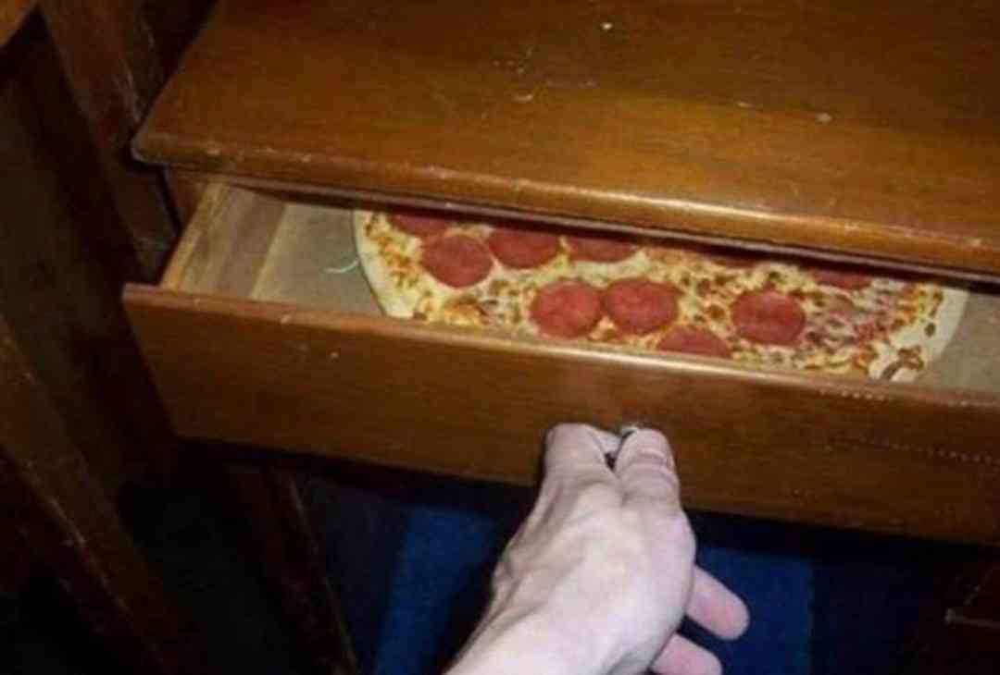

## PAWNG Idea: Near Miss PAWNG
This week, I worked upon checking out PAWNG and getting some form of a prototype going. I thought back to a game that surprisingly took up parts of my time: Pacman Championship Edition.

That game is an incredibly fast paced experience, as the game itself expects you to already know and somewhat have mastered how Pac-Man works. You move fast, the ghosts move fast, and the game is slightly unforgiving in that regard.

There is, however, a saving grace to it: when a ghost is about to capture you, the game itself slows to a crawl, allowing you to reposition if you need to.

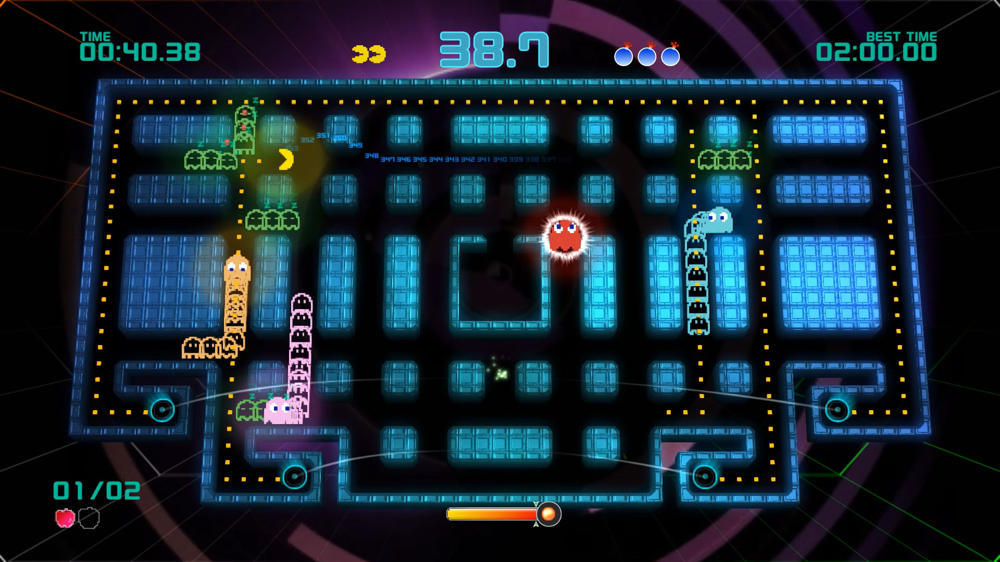

I figured I could maybe try something like that for this experience, so I thought of a sketch for it: near miss PAWNG.

With this, the goal isn't to keep a volley, it's a 1 or 2 person sudden death survival where the goal is to dodge the pieces coming towards you. However, dodging them won't net you any points.

The goal is to narrowly miss the goal, which nets you a certain amount of points depending on how many you can do in a row. And if you get hit, your score either deducts or resets.

I thought, for this, maybe it could be that, if you hit the ball while on a roll, your combo resets, and if you get hit without any combo going, your score completely resets, somewhat like how Sonic deals with health with its rings system.

I would've coded a prototype, but I'll leave that for next week, as the prototype completely died on me and I couldn't include anything concrete. Plus, I also don't entirely want to put a sole prototype on itch.io quite yet.

# Week 4 - February 12, 2026

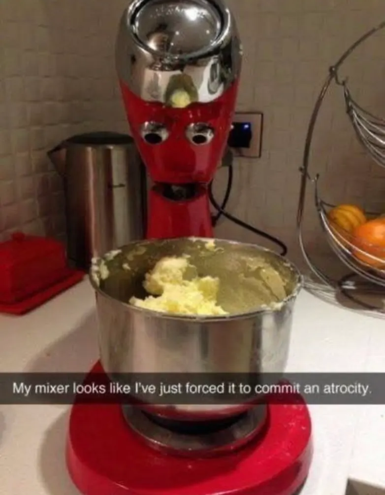

## Approach for Breakthrough

For this week, I decided to take some more notes regarding how I design prototypes, mainly using my variation jam as an example for the prototype design process I use.

https://seangregoryv8.github.io/cart253/assignments/variation-jam/

For the process here, I knew that I had wanted to program Breakout and make alterations to it, so my first step in the process was to analyze and program base Breakout first. I needed to get random blocks to spawn in, get paddle movement working, get the ball physics going, and program in the death and win conditions. Once all of those were done, I would be able to move on to prototyping various ideas with the main skeletal structure going. With this, I got working on a power up mode, where I simply made an extra clause that allowed for a powerup to spawn. That, combined with a powerup class that handled what would spawn and what the powerup would do, and the power up mode was set.

Afterwards, I made a joke random number generator mode, where random effects would occur. This mainly involved me cycling through the code, seeing parts that I could randomize, and randomizing it thanks to a new function.

The next mode, a prediction mode, was the hardest to code, as I needed to not only centre the ball and reset it after every time, but to also hard-knock its launch to stay consistent every time. It essentially acted as gambling and skill combined, where you predict how many bounces (wall, brick and ceiling) it would make before the ball would hit the floor, rewarding you with more points the closer you got to the predicted outcome.

Overall, with everything mentioned, the way I prototype is the following: build the base product, make sure it feels like how you want it to feel, and then alternate with new ideas. Make something solid first, and then work from there.

# Week 5 - February 19, 2026

## More visualizing for how to properly prototype

I did not have as much time as I had thought I would have, given midterms were fully rolling through. So I decided to do something simplistic.

When I started to work on this idea, I wanted to try something different from how I did Breakthrough: simple, not overcomplicated, getting somegthing straight up working.

I opened up Unity, deciding that I wasn't gonna build the full game, but rather explore its options.

I opened up a blank 2D scene, generated simple shapes (squares, circles), and followed some tutorials for object manipulation, incorporating game mechanics solely by paper. Collision, movement, even though we had other tutorials from it beforehand. I watched how other people structured their scripts, and got some ideas for how to keep things clearer (alongside not making Unity crash every 2 hours).

Afterwards, I messed around with physics: I opened RigidBody2D, played with some defying gravity, experimented with various collider shapes, and tested some materials. Bounciness, friction, cranking them to their extremes to note the differences (and laugh a bit). It actually helped more than I expected. Watching how other people structure their scripts and components gave me a few small ideas for keeping things cleaner.

After that, I started messing around with physics. I added Rigidbody2D components, played with gravity (and then turned it off), and experimented with different collider shapes. I tested physics materials too — changing the bounciness and friction just to see how extreme I could make things feel. A really bouncy object felt chaotic and stressful, while a less bouncy one felt more controlled. Even though near miss PAWNG isn’t about keeping a volley like Breakout, the “feel” of movement still matters a lot.

Then I moved into texturing. I imported some simple placeholder textures and applied them to the shapes. Some of them looked stretched or blurry at first, so I adjusted the import settings and pixels per unit to see how that changed things. I tried flat colors versus simple gradients, and honestly, the flat colors felt better. They were cleaner and easier to read, which makes sense for a reaction-based survival game.

While I was testing all this, I kept thinking about how the “near miss” mechanic would actually work. So instead of building the whole game, I prototyped just that part. I added a slightly larger invisible trigger around the player’s hitbox. If an object passed through that outer zone without actually colliding, it would count as a near miss and increase a combo counter. Seeing that work, even in a super rough version, was exciting. It actually created tension — you could feel how close you were cutting it.

I also experimented with basic UI. I added simple text elements to display score and combo, and played around with positioning and scaling so they stayed readable. Even small adjustments like font size and spacing made the scene feel more intentional and less like a prototype.

Overall, this session wasn’t about finishing anything. It was about experimenting. Watching tutorials wasn’t about copying them exactly — it was more about picking up little workflow habits and ideas. Testing shapes, tweaking physics, swapping textures — all of it helped me understand what direction this could go in.

If anything, this reminded me that prototyping is less about building something polished and more about figuring out what feels right. Right now, near miss PAWNG is still very rough, but it’s starting to feel like something real.

# Week 6 - February 26, 2026

## 3 Favourite Game Prototype Ideas from Last class
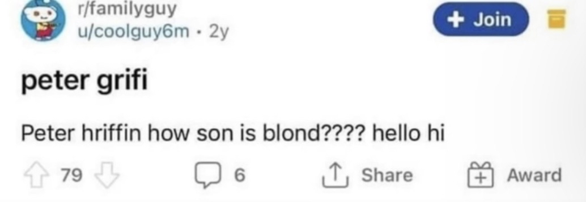

### Idea #1: Card RPG
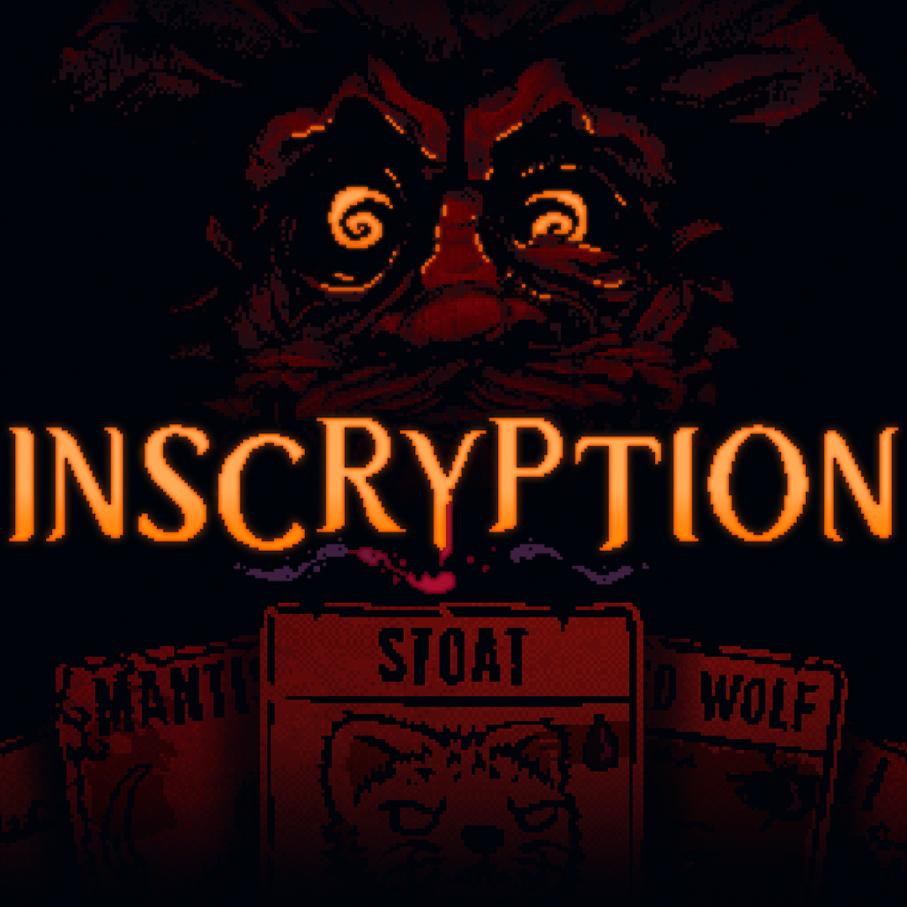
From the speed dating game prototype session, the two of us came up with an interesting idea: creating an RPG comprised entirely of a fictional card game. You come across various people with various skill levels, and must beat all of them within this tabletop game in order to progress.

An interesting factor, however, is the luck involved near the end of it. Each time you win or lose, a number of die will be rolled, determining your earnings, XP gained, or otherwise. Additionally, a special Dx20 die will be rolled where, given a high enough number, may gift you or the enemy a second chance at the game.

However, your performance will be monitored and collected, allowing for you to only roll a certain number set (if you did very well, you may get any number below 8 completely taken out, allowing greater rewards. If you barely survived a win, you may only be able to roll as high as a 14).

Each enemy will get some kind of special ability through the game that they can use, and you must use only your wits and own set of cards at certain levels in order to triumph!

### Idea #2: 10 Minutes to Die

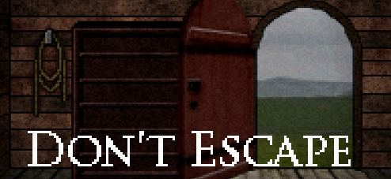

A point-and-click visual novel kind of game that I had inspired by a flash game I played when I was younger, Don't Escape, the plot is simple: you are a passenger on board an aircraft, and midway into the flight, you receive a premonition that the plane will completely explode by mysterious means. No engine failure, a pure act of God that cannot be avoided. This explosion will happen in exactly 10 minutes, meaning you have exactly 10 real-life minutes to live. What you do in that time is up to you.

It does sound like the opening plot of a popular film franchise Final Destination, where a character would have a premonition about a horrific accident that would claim many lives. The character would manage to stop the premonition from happening and spare a decent few lives, but Death (in this movie) would not forget, and would hunt down the survivors who managed to cheat him one by one. It has spanned a total of 6 mainline movies (1-5 numerically alongside a 6th called "Bloodlines")

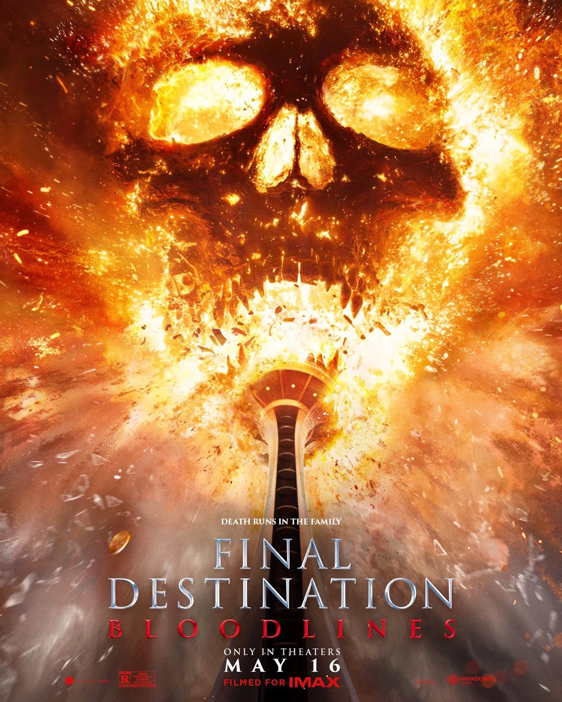

In this game, there are plenty of other passengers on board, and a variety of options for you to explore or even try to get as few casualities as possible. You can try to pursuade the passengers to believe you with certain good prompts, you can find someone sketchy, convince him to tell you his suitcase number, go underneath the plane, take a gun, and hijack the plane to emergency land it, getting everyone off before it explodes. You can try to bring everyone to the very back of the plane, or jump off at the right time in order to have a chance to survive.

Or you can do absolutely nothing, waiting out the time until the end. You'd only have two modes of player interaction besides on-text prompting: an inventory system for you to store valuables during the 10-minute playthrough, and a button to simply wait it out, whether you want to simply speed up the inevitable or have finished everything you can think of finishing.

The choices are entirely up to you!

### Idea #3: Chat-DND

An idea that Bianca and I had was utilizing AI LLMs and creating a prototype from it. You would play as the village protector/hero, alongside a pre-set village filled with villagers. Each one will have unique personalities, things they like and dislike, their relationship with the player and others, and others.

The kicker is that, at random times, there will be some randomly-timed events that will occur, for example, wolves invading where you must run them out, or enemy raiders, or even something as simple as moving cows around. Basic tasks, and ones that the AI will completely generate, and that the game will go along with.

Additionally, there will be 2 other companions for you to get: a guy whose whole point is giving hints and instructing the player where to go, and another with a banjo guitar that will play constant music depending on whats happening.

### TorToiSe_TTS
https://github.com/neonbjb/tortoise-tts

We decided to try out TorToiSe-TTS, alongside Ollama, which can generate and say out things. We could've gone with something more akin to infinite dialogue, but believe that AI could be so much more to this equation without taking over everything outright.

Here's some demo material that we did and discoveries we made regarding TorToiSe:

### Machine Learning Architectures Used
1) **Autoregressive transformer (UnifiedVoice)**: Generates discrete speech codes step‑by‑step, similar to how GPT generates text.
This stage determines pacing, phrasing, and rough prosody.
It’s conditioned on voice latents extracted from reference clips.
2) **Diffusion decoder (DiffusionTts)**: Refines the discrete codes into a high‑quality mel‑spectrogram.
Diffusion makes audio smoother and more realistic.
Tortoise uses conditioning‑free diffusion (two passes, blended) to improve realism.
3) **Neural vocoder (UnivNet)**: Converts the mel‑spectrogram into a 24 kHz waveform.
Vocoder quality is critical for natural speech.
4) **Candidate ranking (CLVP / CVVP)**: Tortoise generates many candidates, then scores them.
CLVP and CVVP help choose the best output for realism and voice match.

### How It Was Trained
> From Advanced_Usage.md:

- Trained on ~50,000 hours of speech, primarily audiobooks.
- Training took months on a homelab with 8× RTX 3090 GPUs.
- Training used the author’s DLAS trainer.
- Training configs are not released, so full reproduction is not possible.

### Capabilities and Affordances
What It Generates:

- Speech audio only (24 kHz WAV).
- It does not generate images, video, or music.

Required Inputs:
- Text prompt (what to say).
- Optional reference voice clips (2–5 clean ~10s WAVs).
- Optional settings (preset or advanced knobs).

API / Interfaces Available
- Python API: TextToSpeech in api.py and api_fast.py.
- CLI scripts: do_tts.py, read.py, read_fast.py.
- Socket streaming: socket_server.py (for real‑time style output).

Creative Possibilities
- Voice cloning / NPC dialogue
- Narration (audiobook‑style voice)
- Interactive installations (generative speech output)
- Character design (mix and match voice latents)

### Biases and Limitations
> From Advanced_Usage.md

Dataset bias
- Audiobook data dominates → strong bias toward “narrator voice.”
- Model performs poorly on strong accents and minority voices.

Compute bias
- High quality requires GPU. CPU is extremely slow.
- Limits accessibility for people without GPUs.

Input quality bias
- Reference clips with noise/reverb perform worse.
- Clean audio gives much better voice cloning.

Ethical risks
- Voice cloning can be misused.
- Author provides a Tortoise‑detect classifier but notes it’s not perfect.

### Bianca's Repo
We put all our findings into this repository:
https://github.com/Biwanka/CART498-GenAI/tree/main/Tortoise

### Generated Audio

Here were some pieces we generated for our experiment into this:

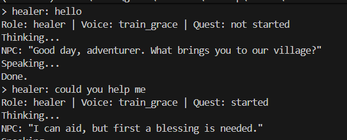

<video width="320" height="240" controls>
  <source src="./tortoise_4.mp4" type="video/mp4">
  Your browser does not support the video tag.
</video>

<video width="320" height="240" controls>
  <source src="./tortoise_5.mp4" type="video/mp4">
  Your browser does not support the video tag.
</video>

<video width="320" height="240" controls>
  <source src="./tortoise_6.mp4" type="video/mp4">
  Your browser does not support the video tag.
</video>