# Week 1 - January 22, 2026

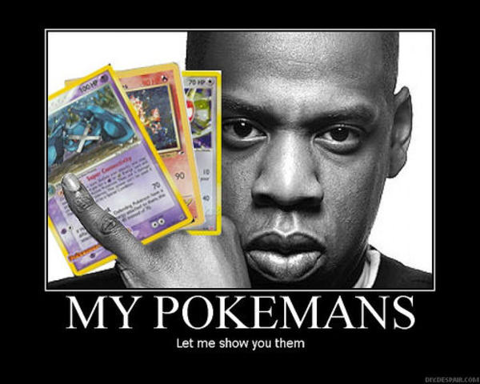

## Make a Thing - KEEP PLAYING AND NOBODY EXPLODES

In this game, you have one simple goal: prevent the timer from reaching 0. If you do, the bomb explodes and it's game over.

However, there's one small caviat: there are multiple microgames on the bomb, ranging from valves that exhaust steam unless you close them to aligning cards, all of which prevents you from pressing the button to stop the detonation. You have to manage your resources and time, going through all the noise and struggle to concentrate and reset the timer by pressing the button, to keep playing so that nobody explodes.

## Process

### Day 1:
I knew I wanted to make some kind of management game as my first endeavor with a prototype, especially one with multiple little games so I could complete a few and see how they work. My central idea for this came from a game I hold dear to my heart: Keep Talking and Nobody Explodes, which I played religiously with a buddy of mine when we were both pre-teens. I sketched out a couple ideas for puzzles I knew I wanted to implement, including a number pad that would have a combination you'd have to answer to defuse it and a certain number you had to reach, only you could increment by +1 or +10 to achieve it. I knew what I wanted, but now became the goal of implementing it.

I quickly started by sketching out a grid of 400x400 squares where everything would be, with the button at the bottom right as a constant reminder. One big thing I wanted was custom sketch art, specifically of the bomb, to demonstrate its importance. The sketch was relatively easy as-is:

Now that that was done, it got late, so I decided to keep it for another day.

### Day 2

I used this as my primary code and first trap day. I coded in a simple countdown for the timer, and then coded a way for you to interact with the button to reset it, creating an infinite loop, exactly what I wanted.

Next, I set up systems that would prevent it from going off if any boolean in an object were false, which is where all my traps would go. With that set up, I started on my first trap: a numberpad Trap.

I got back on the pixel art editor and coded it in 3 parts: the buttons, the numbers, and the combination of the two being the padlock:

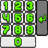

I coded together each end-case, where each button would be pressed, since I believed that coding them individually would take longer. I got each sprite imported into the project, fitted it correctly using some simple math to divide the board into its individual cubes, and worked on the logic to click on them. Once the hitboxes were all fully finished, I quickly coded a "correct combination", a randomly-generated 5 digit code, and coded together the way to "solve" it by splitting it into its individual numbers and checking them off once each one was correct, with it resetting if you got it wrong and turning off if you got it right.

A pattern began to emerge for the event system, that being when the trap would commence, what would happen when it did, and how to disable it. I carried this over with me for all the rest of the traps.

Finally, to end the day, I started to draw out the rest of the pixel art, such as buttons for another microgame:

### Day 3

This is where I did 3 other traps to round things off. I knew I wanted one involving mouse movement, one involving mathematics, and another involving patterns, since I already did the one for memory.

#### Next traps
The first one I tackled was the mouse movement. From the start, I wanted some kind of valve to release steam, where you'd have to physically rotate the mouse a certain way to stop it.

#### Valve Trap
This involved tinkering. I first coded an easy rectangle for the valve and reused my particle system from another game, changing their values and rendering it as "steam". Afterwards, I reused previous code to activate and dispell the trap, matching it to the boolean object that prevents the button from being pressed.

#### Valve Rotation
Afterwards came the hardest part of the game: figuring out the rotations. Rotating the rectangle itself was fine, finding the central area and, after clicking, moving the rectangle to rotate along with wherever the mouse was. However, it was counting those rotations that became quite difficult. The current math I have going on would take a while to explain, mainly involving sin waves, constrains, atan2, and other portions, but once that was finished, it was able to detect a certain amount of rotations. All that was left was to code an "end" amount of rotations that triggered the endEvent, coding a "correct" rotation, whether clockwise or counterclockwise, and then finalizing it with some fun sound effects so the player would know where to go.

#### Exact Trap
The next one was very easy to do: the exact trap. I simply grabbed two rectangles, coded two numbers into them, that being your present value and the desired value, and coded each button to add or subtract 1 or 10 from the present value by reusing previous code for the buttons before. After that, it was only a matter of checking if the values matched whenever the buttons were pressed and stopping the trap when they did. Nothing too special here minus some funny sound effects.

#### Deck Trap
Finally, for the memory matching game, I crafted various cards with various distinct shapes onto them to make it easier at a glance:

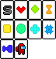

Afterwards, I then decided to be a bit special and code a custom class for a card, complete with its name, its value (sprite), whether it was face up or down, and whether it was solved. Go through each card in a for loop, spawn two of them, and then display them in a nested for loop in a 4x4 radius. Once that was done, it was a matter of "saving" what card was read, comparing it with another card chosen, flipping them both back up if you were wrong and keeping them both down when you were right. Once they were all down, the trap would disarm.

With that, I experimented and played with the game to test how fun it was, and it turned out to be a very nice experience overall with the game! The last day would be mostly polishing.

### Day 4
Today was mostly polishing details out.

#### Distinct sounds
I wanted each trap to have its own distinct sound, so the user would know what was active when. I got a realistic card shuffle sound for the deck trap, Microsoft SAM to voice out the numberPad trap, realistic steam noises for the valve trap (alongside its visuals), and a deeper Mortal Kombat "Test your Might" voice for the exact trap. After implementing different types of fun sounds for interactivity and immersion (a valve turning, retro sounds for picking cards, Microsoft SAM voicing each number you dialed, and pass/fail sounds for each), I knew what I wanted last was music. I decided to go with Carnival Night Zone Act 1 from Sonic 3 Prototype:

https://www.youtube.com/watch?v=Be3B-_ZrGu8

I figured it would be a nice touch.

#### Game Over

However, one thing my game lacked and desperately needed to be complete was a complete game loop, meaning a game over. I coded a flashing red sound for a "bomb explosion" and got the mine explosion sound from Minesweeper Plus by Jorel, as well as coding 10 different "game over" lines in Microsoft SAM that would be spoken, all combining together as the player "reacting" to losing, before the bomb explodes. I quickly coded together a "total elapsed time" to show how long they lasted, with spacebar then being coded to completely reset and restart the game, thus tying the gameplay loop together!

### Future plans

I already have a lot on my plate, so I doubt I'll be re-exploring this, but if I did, I would love to try getting "true randomness" on when the traps would arm, allowing for less of a "they all activate near all at once" and more of "you have to properly manage things". Additionally, I would add other traps, with each reload having them be at a random place, maybe 10 ish traps that would alternate so you would have 4-5 traps each. Finally, I would likely add a difficulty setting, that would allow for more tense gameplay being rewarded with more points or something.

To be honest, this was taking a lot of space in my head, and I really wanted to use this as an opportunity to get it out in terms of a "prototype". I'm quite proud with what I've done over the course of not even 4 days, and proud that I got to make some cool and custom sprite art, as well as experiment with a "Wario-Ware" kinda microgame mechanic, alongside me and my friends having fun playing it overall.

# Week 2 - January 29, 2026

## Goofing around in Unity

For this week, I mostly messed around in Unity, checking out some various tutorials, notably checking out a game made by a friend of mine.

Unity had a built-in tutorial that I followed to the best of my abilities, quickly getting the hang of some various portions (when it decided to actually work).

First thing in Unity was a character that already moved, so we got familiar with character movement and creation, alongside speed change, and interactivity with certain objects in the map. All these were adjustible.

Next tutorial was asset management, taking certain assets and transferring them to empty scenes, understanding object sizing. We were told to make a new object, in this case a ball, and modified its colliding sturctures (with a ramp) and bounciness with certain values, understanding how to create values in unity ourselves (changing colour, metallic, roughness, etc)

Finally, the third tutorial was audio related/foley, how to add objects, make it loop, send objects towards them, and the centralized portions just with audio.

# Week 3 - February 5, 2026
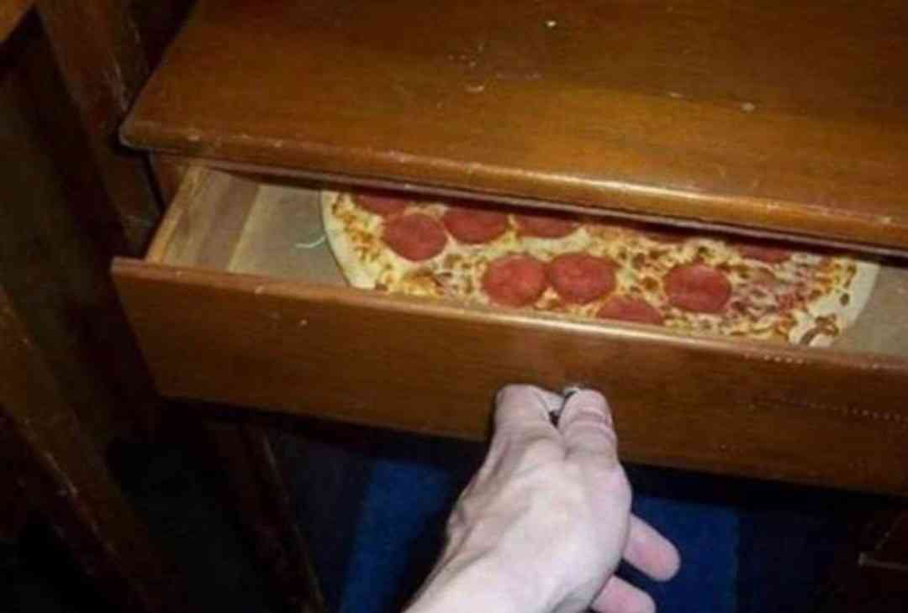

## PAWNG Idea: Near Miss PAWNG
This week, I worked upon checking out PAWNG and getting some form of a prototype going. I thought back to a game that surprisingly took up parts of my time: Pacman Championship Edition.

That game is an incredibly fast paced experience, as the game itself expects you to already know and somewhat have mastered how Pac-Man works. You move fast, the ghosts move fast, and the game is slightly unforgiving in that regard.

There is, however, a saving grace to it: when a ghost is about to capture you, the game itself slows to a crawl, allowing you to reposition if you need to.

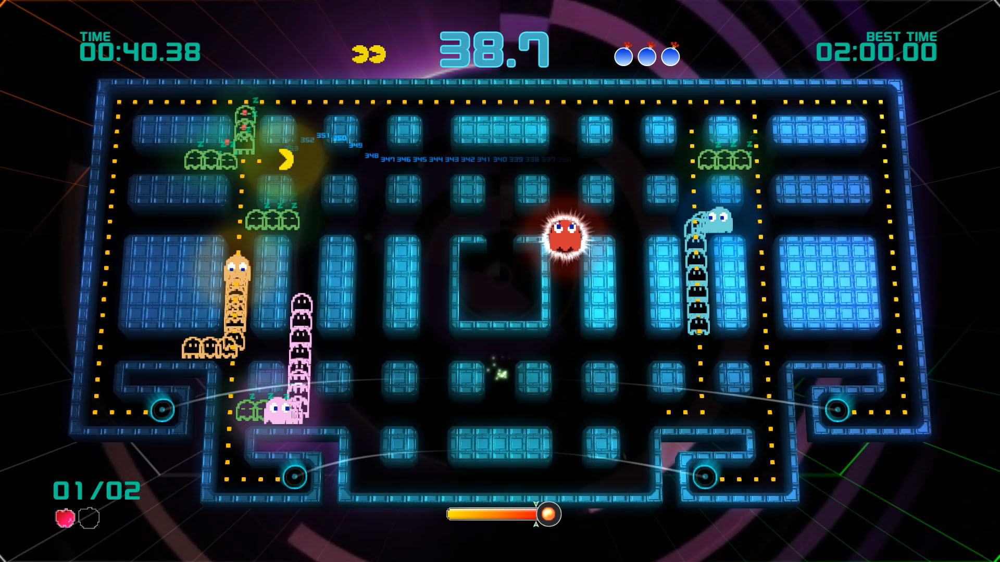

I figured I could maybe try something like that for this experience, so I thought of a sketch for it: near miss PAWNG.

With this, the goal isn't to keep a volley, it's a 1 or 2 person sudden death survival where the goal is to dodge the pieces coming towards you. However, dodging them won't net you any points.

The goal is to narrowly miss the goal, which nets you a certain amount of points depending on how many you can do in a row. And if you get hit, your score either deducts or resets.

I thought, for this, maybe it could be that, if you hit the ball while on a roll, your combo resets, and if you get hit without any combo going, your score completely resets, somewhat like how Sonic deals with health with its rings system.

I would've coded a prototype, but I'll leave that for next week, as the prototype completely died on me and I couldn't include anything concrete. Plus, I also don't entirely want to put a sole prototype on itch.io quite yet.

# Week 4 - February 12, 2026

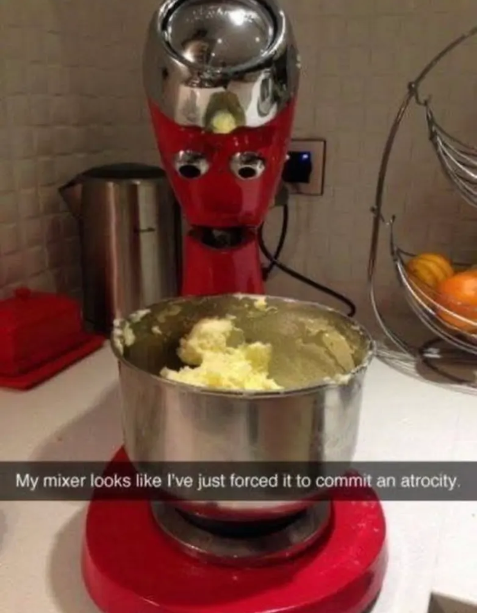

## Approach for Breakthrough

For this week, I decided to take some more notes regarding how I design prototypes, mainly using my variation jam as an example for the prototype design process I use.

https://seangregoryv8.github.io/cart253/assignments/variation-jam/

For the process here, I knew that I had wanted to program Breakout and make alterations to it, so my first step in the process was to analyze and program base Breakout first. I needed to get random blocks to spawn in, get paddle movement working, get the ball physics going, and program in the death and win conditions. Once all of those were done, I would be able to move on to prototyping various ideas with the main skeletal structure going. With this, I got working on a power up mode, where I simply made an extra clause that allowed for a powerup to spawn. That, combined with a powerup class that handled what would spawn and what the powerup would do, and the power up mode was set.

Afterwards, I made a joke random number generator mode, where random effects would occur. This mainly involved me cycling through the code, seeing parts that I could randomize, and randomizing it thanks to a new function.

The next mode, a prediction mode, was the hardest to code, as I needed to not only centre the ball and reset it after every time, but to also hard-knock its launch to stay consistent every time. It essentially acted as gambling and skill combined, where you predict how many bounces (wall, brick and ceiling) it would make before the ball would hit the floor, rewarding you with more points the closer you got to the predicted outcome.

Overall, with everything mentioned, the way I prototype is the following: build the base product, make sure it feels like how you want it to feel, and then alternate with new ideas. Make something solid first, and then work from there.

# Week 5 - February 19, 2026

## More visualizing for how to properly prototype

I did not have as much time as I had thought I would have, given midterms were fully rolling through. So I decided to do something simplistic.

When I started to work on this idea, I wanted to try something different from how I did Breakthrough: simple, not overcomplicated, getting somegthing straight up working.

I opened up Unity, deciding that I wasn't gonna build the full game, but rather explore its options.

I opened up a blank 2D scene, generated simple shapes (squares, circles), and followed some tutorials for object manipulation, incorporating game mechanics solely by paper. Collision, movement, even though we had other tutorials from it beforehand. I watched how other people structured their scripts, and got some ideas for how to keep things clearer (alongside not making Unity crash every 2 hours).

Afterwards, I messed around with physics: I opened RigidBody2D, played with some defying gravity, experimented with various collider shapes, and tested some materials. Bounciness, friction, cranking them to their extremes to note the differences (and laugh a bit). It actually helped more than I expected. Watching how other people structure their scripts and components gave me a few small ideas for keeping things cleaner.

After that, I started messing around with physics. I added Rigidbody2D components, played with gravity (and then turned it off), and experimented with different collider shapes. I tested physics materials too — changing the bounciness and friction just to see how extreme I could make things feel. A really bouncy object felt chaotic and stressful, while a less bouncy one felt more controlled. Even though near miss PAWNG isn’t about keeping a volley like Breakout, the “feel” of movement still matters a lot.

Then I moved into texturing. I imported some simple placeholder textures and applied them to the shapes. Some of them looked stretched or blurry at first, so I adjusted the import settings and pixels per unit to see how that changed things. I tried flat colors versus simple gradients, and honestly, the flat colors felt better. They were cleaner and easier to read, which makes sense for a reaction-based survival game.

While I was testing all this, I kept thinking about how the “near miss” mechanic would actually work. So instead of building the whole game, I prototyped just that part. I added a slightly larger invisible trigger around the player’s hitbox. If an object passed through that outer zone without actually colliding, it would count as a near miss and increase a combo counter. Seeing that work, even in a super rough version, was exciting. It actually created tension — you could feel how close you were cutting it.

I also experimented with basic UI. I added simple text elements to display score and combo, and played around with positioning and scaling so they stayed readable. Even small adjustments like font size and spacing made the scene feel more intentional and less like a prototype.

Overall, this session wasn’t about finishing anything. It was about experimenting. Watching tutorials wasn’t about copying them exactly — it was more about picking up little workflow habits and ideas. Testing shapes, tweaking physics, swapping textures — all of it helped me understand what direction this could go in.

If anything, this reminded me that prototyping is less about building something polished and more about figuring out what feels right. Right now, near miss PAWNG is still very rough, but it’s starting to feel like something real.

# Week 6 - February 26, 2026

## 3 Favourite Game Prototype Ideas from Last class
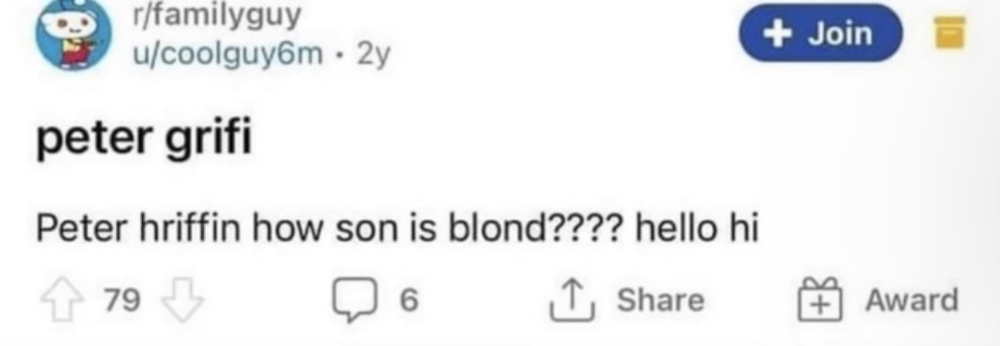

For this class, I took 3 of my ideas that we had discussed from last week, expanded a bit upon them, and heavily delved into one of the topics, getting a prototype ready.

### Idea #1: Card RPG
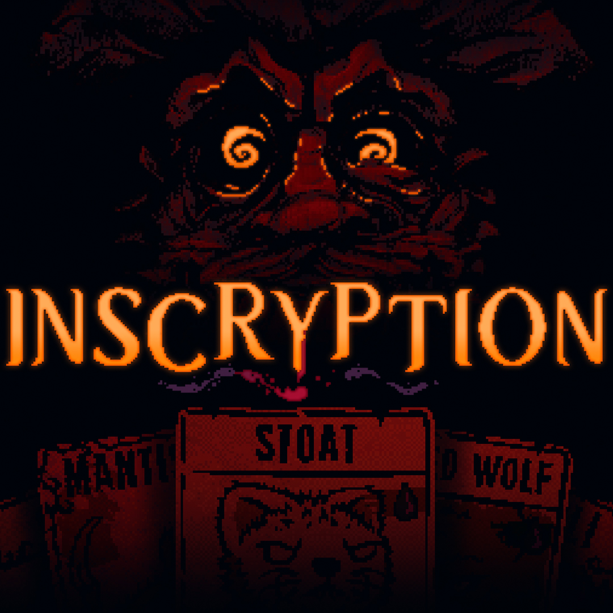
From the speed dating game prototype session, the two of us came up with an interesting idea: creating an RPG comprised entirely of a fictional card game. You come across various people with various skill levels, and must beat all of them within this tabletop game in order to progress.

An interesting factor, however, is the luck involved near the end of it. Each time you win or lose, a number of die will be rolled, determining your earnings, XP gained, or otherwise. Additionally, a special Dx20 die will be rolled where, given a high enough number, may gift you or the enemy a second chance at the game.

However, your performance will be monitored and collected, allowing for you to only roll a certain number set (if you did very well, you may get any number below 8 completely taken out, allowing greater rewards. If you barely survived a win, you may only be able to roll as high as a 14).

Each enemy will get some kind of special ability through the game that they can use, and you must use only your wits and own set of cards at certain levels in order to triumph!

### Idea #2: 10 Minutes to Die

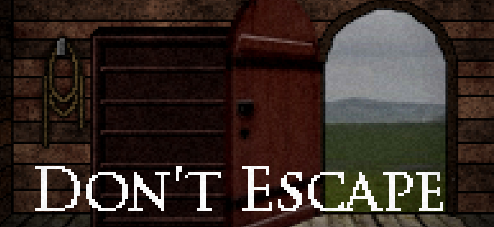

A point-and-click visual novel kind of game that I had inspired by a flash game I played when I was younger, Don't Escape, the plot is simple: you are a passenger on board an aircraft, and midway into the flight, you receive a premonition that the plane will completely explode by mysterious means. No engine failure, a pure act of God that cannot be avoided. This explosion will happen in exactly 10 minutes, meaning you have exactly 10 real-life minutes to live. What you do in that time is up to you.

It does sound like the opening plot of a popular film franchise Final Destination, where a character would have a premonition about a horrific accident that would claim many lives. The character would manage to stop the premonition from happening and spare a decent few lives, but Death (in this movie) would not forget, and would hunt down the survivors who managed to cheat him one by one. It has spanned a total of 6 mainline movies (1-5 numerically alongside a 6th called "Bloodlines")

In this game, there are plenty of other passengers on board, and a variety of options for you to explore or even try to get as few casualities as possible. You can try to pursuade the passengers to believe you with certain good prompts, you can find someone sketchy, convince him to tell you his suitcase number, go underneath the plane, take a gun, and hijack the plane to emergency land it, getting everyone off before it explodes. You can try to bring everyone to the very back of the plane, or jump off at the right time in order to have a chance to survive.

Or you can do absolutely nothing, waiting out the time until the end. You'd only have two modes of player interaction besides on-text prompting: an inventory system for you to store valuables during the 10-minute playthrough, and a button to simply wait it out, whether you want to simply speed up the inevitable or have finished everything you can think of finishing.

The choices are entirely up to you!

### Idea #3: Chat-DND

An idea that Bianca and I had was utilizing AI LLMs and creating a prototype from it. You would play as the village protector/hero, alongside a pre-set village filled with villagers. Each one will have unique personalities, things they like and dislike, their relationship with the player and others, and others.

The kicker is that, at random times, there will be some randomly-timed events that will occur, for example, wolves invading where you must run them out, or enemy raiders, or even something as simple as moving cows around. Basic tasks, and ones that the AI will completely generate, and that the game will go along with.

Additionally, there will be 2 other companions for you to get: a guy whose whole point is giving hints and instructing the player where to go, and another with a banjo guitar that will play constant music depending on whats happening.

Here was the original pitch:

> Fantasy RNG DND Generator, you play as a village hero that has to defend his village from a variety of task. These can include raids, enemy encampments, or even something as simple as getting fruit or rescuing cats or something The key is that AI will be usedto generate them, what scenarios they're in, and what is done when. Each villager in the encampment will have certain levels of either paranoia, their own personality (AI generated), relationship with others, all figured out by AI. Our personal guide, Chet Gipiti, will be our companion that either informs us on what we have to do, or provide commentary towards our journey. We also have another guy, music man, who will be providing AI generated music that changes every single time, either calming, alerting, or hunting (something like that)

### TorToiSe_TTS
https://github.com/neonbjb/tortoise-tts

We decided to try out TorToiSe-TTS, alongside Ollama, which can generate and say out things. We could've gone with something more akin to infinite dialogue, but believe that AI could be so much more to this equation without taking over everything outright.

We also have a few more resources:

Slides: https://docs.google.com/presentation/d/1a7vhVnTERsJ7BrqbDOIpUsaOg12oATS3dn0-uRKrsEY/edit?usp=sharing

Drive with various sound files:
https://drive.google.com/drive/folders/13W_1ksCVIyc8YuNdk9Px_mcn6uQP77nF

Here's some demo material that we did and discoveries we made regarding TorToiSe:

### Machine Learning Architectures Used
1) **Autoregressive transformer (UnifiedVoice)**: Generates discrete speech codes step‑by‑step, similar to how GPT generates text.
This stage determines pacing, phrasing, and rough prosody.
It’s conditioned on voice latents extracted from reference clips.
2) **Diffusion decoder (DiffusionTts)**: Refines the discrete codes into a high‑quality mel‑spectrogram.
Diffusion makes audio smoother and more realistic.
Tortoise uses conditioning‑free diffusion (two passes, blended) to improve realism.
3) **Neural vocoder (UnivNet)**: Converts the mel‑spectrogram into a 24 kHz waveform.
Vocoder quality is critical for natural speech.
4) **Candidate ranking (CLVP / CVVP)**: Tortoise generates many candidates, then scores them.
CLVP and CVVP help choose the best output for realism and voice match.

### How It Was Trained
> From Advanced_Usage.md:

- Trained on ~50,000 hours of speech, primarily audiobooks.
- Training took months on a homelab with 8× RTX 3090 GPUs.
- Training used the author’s DLAS trainer.
- Training configs are not released, so full reproduction is not possible.

### Capabilities and Affordances
What It Generates:

- Speech audio only (24 kHz WAV).
- It does not generate images, video, or music.

Required Inputs:
- Text prompt (what to say).
- Optional reference voice clips (2–5 clean ~10s WAVs).
- Optional settings (preset or advanced knobs).

API / Interfaces Available
- Python API: TextToSpeech in api.py and api_fast.py.
- CLI scripts: do_tts.py, read.py, read_fast.py.
- Socket streaming: socket_server.py (for real‑time style output).

Creative Possibilities
- Voice cloning / NPC dialogue
- Narration (audiobook‑style voice)
- Interactive installations (generative speech output)
- Character design (mix and match voice latents)

### Biases and Limitations
> From Advanced_Usage.md

Dataset bias
- Audiobook data dominates → strong bias toward “narrator voice.”
- Model performs poorly on strong accents and minority voices.

Compute bias
- High quality requires GPU. CPU is extremely slow.
- Limits accessibility for people without GPUs.

Input quality bias
- Reference clips with noise/reverb perform worse.
- Clean audio gives much better voice cloning.

Ethical risks
- Voice cloning can be misused.
- Author provides a Tortoise‑detect classifier but notes it’s not perfect.

### Bianca's Repo
We put all our findings into this repository:
https://github.com/Biwanka/CART498-GenAI/tree/main/Tortoise

### Generated Audio

Here were some pieces we generated for our experiment into this:

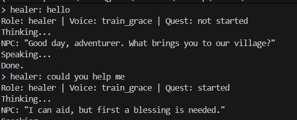

<video width="320" height="240" controls>
  <source src="./tortoise_4.mp4" type="video/mp4">
  Your browser does not support the video tag.
</video>

<video width="320" height="240" controls>
  <source src="./tortoise_5.mp4" type="video/mp4">
  Your browser does not support the video tag.
</video>

<video width="320" height="240" controls>
  <source src="./tortoise_6.mp4" type="video/mp4">
  Your browser does not support the video tag.
</video>

# Week 7 - March 12, 2026

## More prototyping progress on the war game

Now that we've gotten some time to think and plan out our desired goal, here would be the complete version of what we're going for:

## Story

You've been placed within a lone mansion, and aren't quite sure why. You believe you may have been a soldier before, and aren't quite sure if this is real. You seem to have an imaginary friend that follows you around, and he seems quite quaint. He discusses with you about what you have to do: scattered around this mansion are various survivors of war, each with their own stories and, more importantly, their own traumas. When you approach, they will not want to see you, seeing you as a monster prepared to kill them. They will open fire on you, and you need to tame them enough, providing enough suppressive fire for them to stop.

Once they're more calm, you need to "lure" them into a central room in the house: the therapy room. You need to talk to them, convincing them that you're trustworthy, enough for them to slowly follow you into the room. Once you're there, you further discuss, finding fallicies in their arguments to diagnose them, and help them get over their traumas, enough for their souls to be freed from this strange mansion. This funny imaginary creature is there to guide you, and talking enough to him reveals his own true nature of a mad god who has trapped you into here. He has gone completely insane, and enjoys torturing you into doing his bidding. Eventually, you must find his own fallicies, and drive him further and further mad until he eventually horse-shoes back into a clear mind, finally letting you go.

## Research

I split the research into two parts: the Eldritch side and the War side.

### Eldritch

I read a decent amount of Lovecraft books (again) to figure out which parts I wanted to maintain for a psychotic, unhinged feeling game, one that I could put some less psychotic moments within for the tug at the heartstring moments. I noticed some patterns within the writing styles, specifically for how to write dialogue and characters. They all talk in a much more distant manner (if ever they talk at all). In reality, Lovecraft admitted that he wasn't good at writing dialogue, and that he wanted the characters to feel insignificant to the general plot of the story. This way, the dialogue grew to have a more isolated and insignificant feeling. For a character centric game like this, I wanted to put that deeper within the story, where the characters felt so isolated away from everything that you were somewhat forced or even encouraged to treat them like puzzles rather than people, further devolving into the madness of tis place.

### War

Watching various movies and reading various recounts of war demonstrate this exact same isolated feeling. When a soldier of war talks, he isn't really there. They say that a part of you dies when you kill your first man, and that you never truly leave the muddy trenches of battle, and they're right. For the characters in this to work, we need to have them not really be all there, never talking any more than they need to (unless you're at their near breaking point).

### Others
I also wanted to try a couple of games that I wanted to inspire the artstyle or aesthetic of the prototype. Two big ones I went for are No, I am Not a Human and Psychopomp.

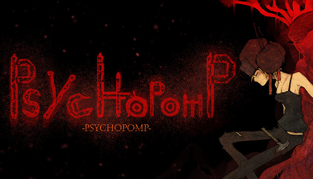
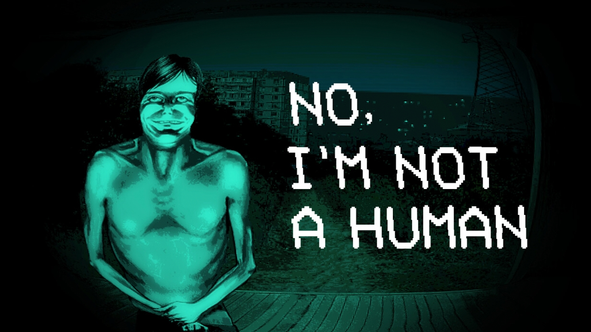

Both of these titles deal a lot with more surreal experiences, and both heavily centre around their characters. The humor in them is sharp, and still works incredibly well for what they do, with one being a more dissection and analysis game into not allowing humans to enter into your home, and the other being one of the most unhinged games ever made.

## Definitions

### PTSD

Post-Traumatic Stress Disorder (PTSD) is a mental health condition that can develop after a person experiences or witnesses a traumatic event—such as violence, serious accidents, natural disasters, war, or life-threatening situations. The condition involves persistent stress reactions in the brain and body even after the danger has passed.

PTSD affects how a person processes memories and emotions related to trauma. Symptoms usually last longer than one month and can significantly interfere with daily life, relationships, work, or sleep.

### **Common Symptoms of PTSD**

Mental health professionals typically group symptoms into four main categories:

---
1. Intrusive Memories

These involve the trauma repeatedly entering a person’s thoughts.

- Distressing memories of the traumatic event
- Flashbacks (feeling as if the event is happening again)
- Nightmares related to the trauma
- Emotional or physical distress when reminded of the event
---
2. Avoidance

People try to avoid reminders of the trauma.

- Avoiding places, people, or activities that trigger memories
- Avoiding talking or thinking about the traumatic event
---
3. Negative Changes in Mood and Thinking

These changes affect how someone sees themselves, others, and the world.

- Persistent negative thoughts about oneself or others
- Feelings of guilt, shame, or blame
- Emotional numbness or detachment from people
- Loss of interest in activities once enjoyed
- Difficulty remembering parts of the traumatic event
---
4. Changes in Arousal and Reactivity

These symptoms reflect the body staying in a constant “alert” state.

- Being easily startled or constantly on guard (hypervigilance)
- Irritability or angry outbursts
- Difficulty sleeping
- Difficulty concentrating
- Risky or self-destructive behavior

## More exploration

The mansion isn’t really about combat or puzzles—it’s about trauma. The people inside it are survivors of war, and the behaviors they show are meant to reflect the kinds of reactions people develop after experiencing something deeply terrifying. In particular, I’ve been reading about Post-Traumatic Stress Disorder (PTSD) and how it can shape the way someone sees the world long after the danger is gone.

From what I understand, PTSD is a condition where a person’s mind and body remain stuck in survival mode after a traumatic event. Even when they’re safe, their brain continues reacting as if the threat is still present. People with PTSD often experience intrusive memories, nightmares, or flashbacks that make the event feel like it’s happening again. They might avoid reminders of the trauma entirely, withdraw from others, or feel emotionally numb. At the same time, their bodies can stay in a constant state of alertness—what psychologists call hypervigilance—where every sound or movement feels like it could signal danger.

That idea explains why the survivors in the mansion react the way they do when the player approaches. They don’t see a helper—they see an enemy. Their minds have been trained by war to expect violence, so when they encounter someone unfamiliar, their first instinct is to defend themselves. The gunfire isn’t meant to make them enemies; it’s meant to show how fear and trauma can distort perception.

Another concept I’ve been thinking about is cognitive distortion—how trauma can twist a person’s thoughts into patterns that reinforce fear or guilt. Some survivors might believe the war never ended, that everyone around them is trying to kill them, or that they deserve punishment for surviving when others didn’t. That last idea, survivor’s guilt, feels especially powerful. It’s the feeling that living through something that killed others is somehow wrong. In the game, these distorted beliefs are what the player has to confront during the conversations in the therapy room.

The mansion itself is strange because it might not be a real place at all. It feels more like a shared mental space—a reflection of the survivors’ damaged memories and unresolved fears. The central therapy room becomes the only place where clarity can exist. Bringing someone there is less about physically escorting them and more about guiding them toward a moment where they can face their trauma instead of running from it.

Then there’s the guide who follows the player around. At first he seems friendly, almost comforting, but the more I think about him, the more unsettling he becomes. He encourages the player forward, but there’s something manipulative about his presence. Eventually it becomes clear that he isn’t just a helper—he’s the one who trapped everyone here. In a way, he represents the chaotic force that feeds on suffering, pushing people to relive their trauma over and over.

What interests me most is the final reversal. The player spends the whole game helping others confront the flaws in their thinking, guiding them toward healing. But in the end, that same process has to be turned on the guide himself. By pointing out the contradictions in his logic and the madness in his cruelty, the player slowly forces him to confront his own broken reasoning. The idea that someone can be pushed so far into madness that they eventually circle back into clarity feels strangely poetic.

I think that’s really what the game is about: the possibility that even deeply fractured minds can move toward understanding. The mansion might be a prison, but the conversations inside it are attempts to unlock the doors.

## Bianca's Drawings

My teammate, Bianca, created some drawings based on some of the examples I had given her, such as Psychopomp, for the style. She designed multiple iterations, and settled on a rough, scratchy style, blending the colour of the trenches (the muddy brown mixed with the dried up deep red blood), and here is what that all looked like.

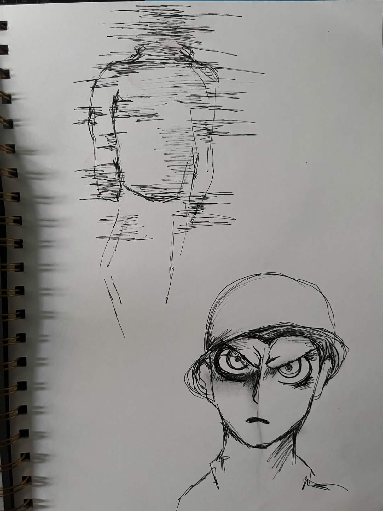
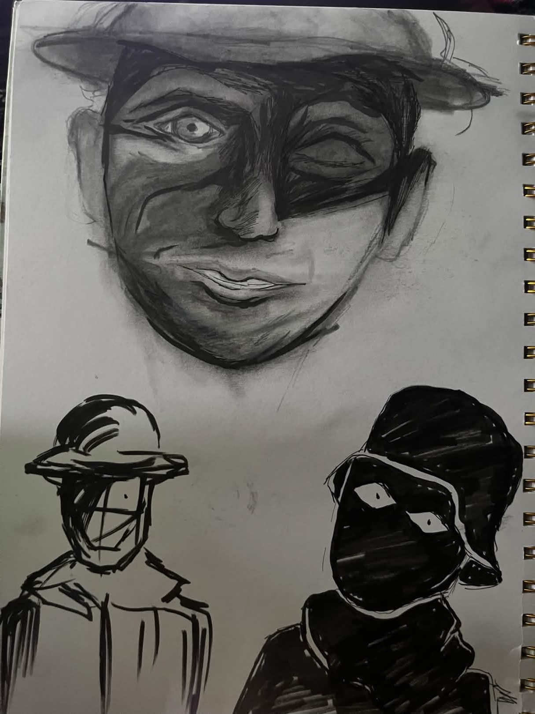
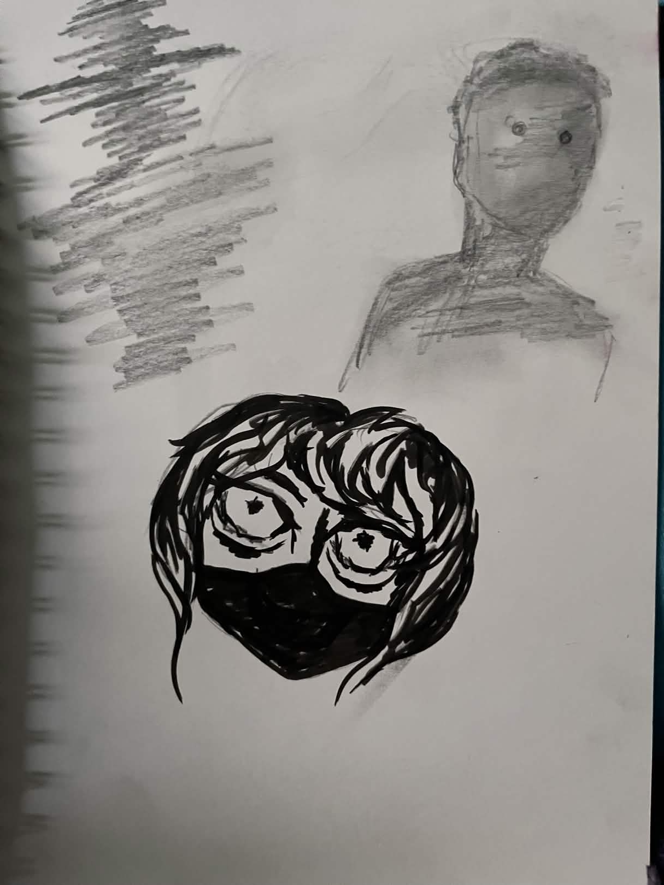
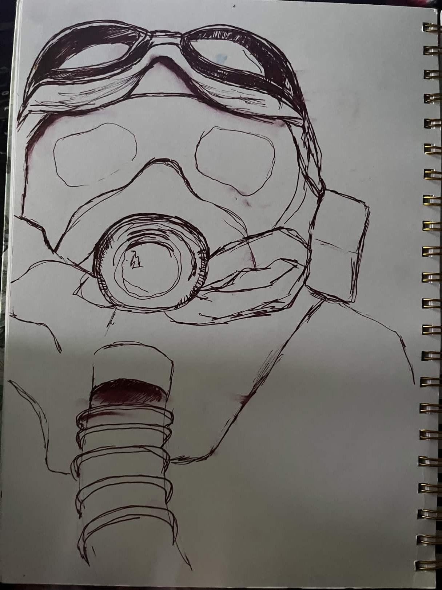
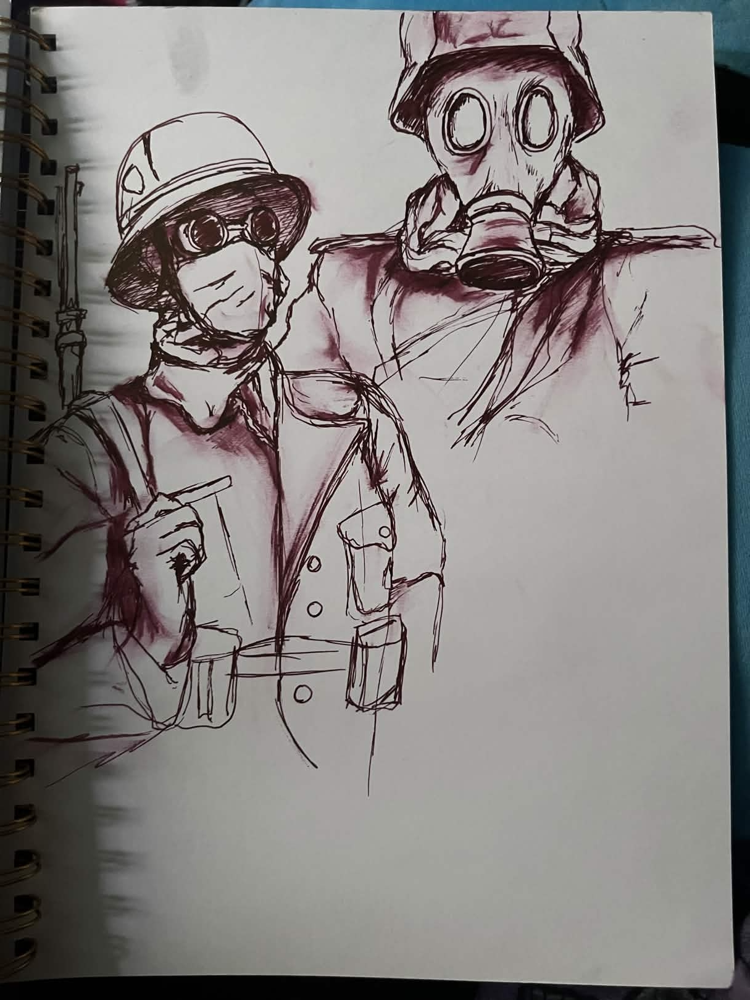
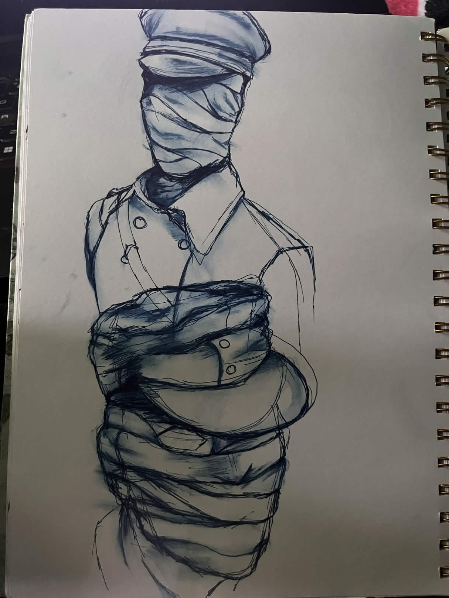
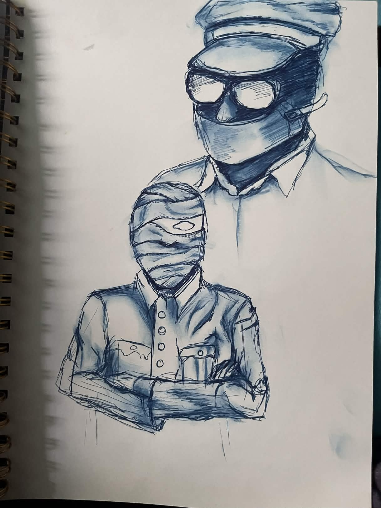
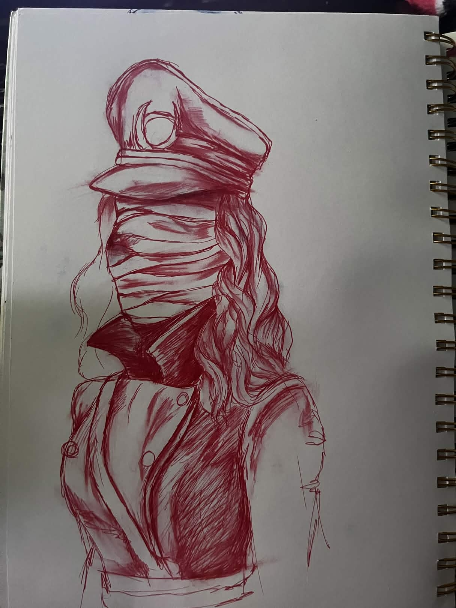
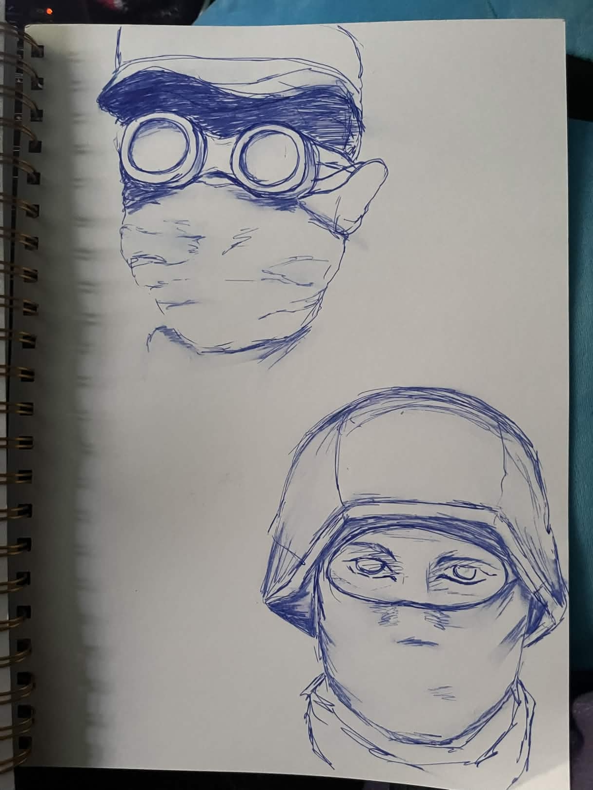
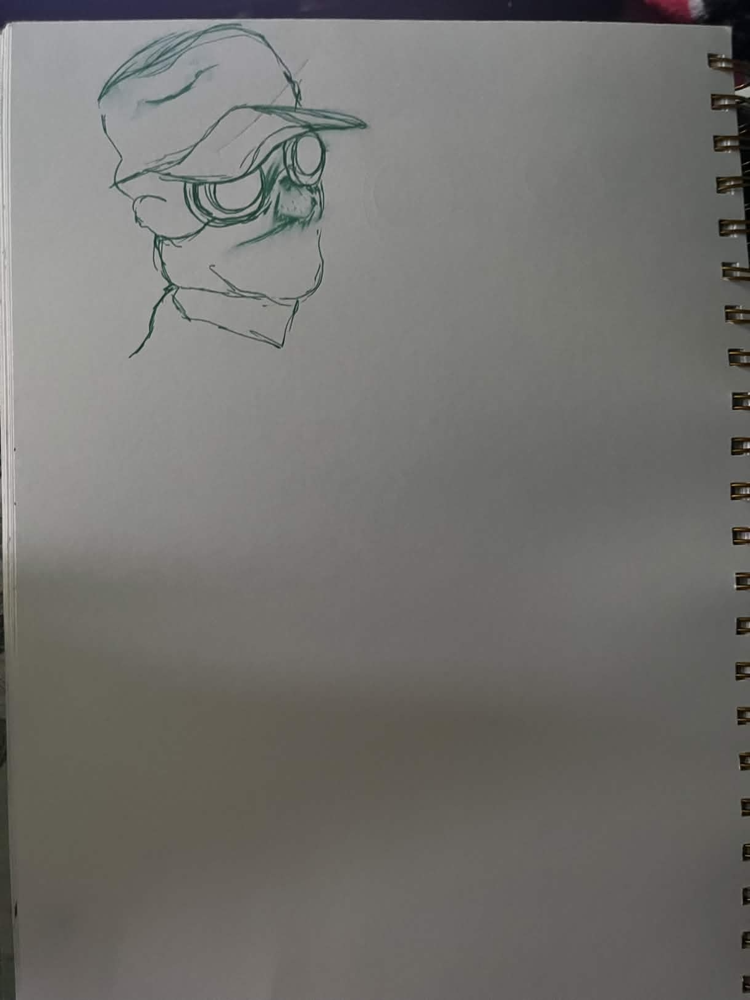

Within these, she focused a lot more on trying to hide the faces, mostly letting the scars speak for themselves, and not directly tying any nationality or individual character.

## AI

For this, we initially wanted to (as mentioned above) use TorToiSe TTS for this, but I was unsuccessful in installing it. Trying multiple times for it, I finally found out that my GPU was too new for it. Luckily, Bianca was able to figure out another service for us to use: 

https://github.com/coqui-ai/TTS.git

This version can work on any GPU, still open source and (mostly) free, and works a lot quicker, essential for a game like this. The next step for this one specifically would be to get this AI working and to see how it functions within the bounds of Unity.

## Mini Prototypes

I worked on 3 separate mini prototypes to test out the 3 concepts for this game.

### Concept 1: FPS

This was the easiest one to work on, since Unity comes pre-packaged with an FPS template. I worked off that, followed a few tutorials and imported a couple of weapons I found online, it only taking a few hours to properly get right for the prototype we were thinking. The gunplay will not be too thourough, since it doesn't entirely matter as much as the others.

### Concept 2: Luring

For this, I had to start from scratch, where I would assign base pathfinding to a set area and, whenever the button was pressed, the block would follow the character. I had to set up spaces where it would stop at some small amount, and would only work when your line of sight was set towards them (and you were close enough). With some finagling, it managed to function (somewhat). Some bugs still need to be sorted.

### Concept 3: Interrogation

I set up a third mini prototype, following a tutorial for base dialogue boxes to be set up. Once I got that working, I then split each one into its individual words, allowing you to choose a word from the bunch to highlight it. It would then copy in your notepad, to which you could put those words together to "diagnose". More tests will need to be done.

### Future test

Once we get the AI wrking, I'll set up a test to get this functioning on Unity, combining the second and third concept in order to actually see it in action.

## Questions

One of the central questions guiding this project is whether artificial intelligence can accurately and respectfully represent real psychological conditions that arise from traumatic experiences such as war. In particular, the game explores characters experiencing symptoms consistent with Post-Traumatic Stress Disorder and related trauma responses.

The goal is not simply to simulate these conditions mechanically, but to see whether AI-driven characters can express believable emotional narratives that reflect the complexity of trauma. If successful, each playthrough would present survivors with different stories, perspectives, and distorted beliefs shaped by their experiences.

Another important question involves ethical representation. Trauma is a serious subject, and the design must avoid turning mental illness into a spectacle. Instead, the intention is to frame the player’s role as one of understanding and empathy, helping characters confront cognitive distortions and fears that stem from their wartime experiences.

Finally, the project asks whether procedural storytelling through AI can support the game’s broader thematic goal: encouraging players to reflect on the human cost of war and to view the conflict not through victory or defeat, but through the psychological scars left behind.

## Fidelity Level

This prototype will likely operate at a mid-fidelity level. The visual and environmental systems may remain relatively simple compared to fully polished games, but significant effort will be placed on the AI characters and narrative interactions.

The focus is on creating survivors who feel believable through dialogue, emotional reactions, and behavioral responses. AI systems will be responsible for generating variations in backstories, trauma responses, and conversations with the player. This approach allows the game to produce different characters and narratives in each playthrough, reinforcing the idea that trauma manifests differently for every individual.

Because the emphasis is on character interaction rather than graphical realism, mid-fidelity visuals are acceptable for this stage of development. The prototype mainly aims to test whether the AI systems can produce consistent, meaningful narrative experiences rather than focusing on final presentation quality.

## What was learned

During early experimentation, several important lessons emerged. The most immediate technical limitation involved hardware compatibility, as the AI model initially tested was unable to run effectively on the available GPU. This highlighted the need to consider computational requirements when selecting AI frameworks for real-time or semi-real-time dialogue generation.

Beyond technical issues, the design process also revealed that representing trauma realistically requires a deeper understanding of several psychological concepts. Conditions like Post-Traumatic Stress Disorder involve multiple overlapping symptoms, including hypervigilance, intrusive memories, avoidance behaviors, and emotional detachment. Each of these responses may need to be modeled separately in order to create believable character behavior.

This realization led to the understanding that the AI system cannot simply generate random dialogue. Instead, individual psychological components—such as fear responses, distrust, survivor’s guilt, and distorted beliefs—may need to be structured or constrained within the AI’s narrative generation to maintain authenticity.

## Next steps

Moving forward, the next stage of development will focus on testing and refining the AI-driven character system. Several key steps are planned:

Evaluate AI frameworks that can run efficiently on available hardware while still generating meaningful dialogue and character responses.

Develop structured narrative prompts that guide AI characters to express believable trauma-related behaviors without producing unrealistic or inconsistent stories.

Prototype survivor archetypes, each representing different trauma responses (such as paranoia, survivor’s guilt, or emotional numbness) in order to test how varied AI-generated narratives can be.

Test player interaction mechanics, particularly the dialogue system in the therapy room where the player identifies logical fallacies and distorted beliefs in the survivor’s reasoning.

Assess ethical representation, ensuring that the portrayal of trauma remains respectful and meaningful rather than sensationalized.

Through these steps, the project aims to determine whether AI can meaningfully contribute to procedural storytelling about trauma, while supporting the game’s broader goal of encouraging reflection on the psychological consequences of war.

# Week 8 - March 19, 2026

For this week, I managed to have a breakthrough with the technology: I made it work in Unity!

After tinkering with it in order to get it to actually run, giving it the proper commands and modifying the entire folder to act independantly, having the voice lines and Ollama.exe installed directly onto it, I was able to get it recognized on Unity. You heard the voice, which works incredibly well.

Additionally, most of my weekend was spent researching the concepts and side effects related to PTSD in order to design the chatbot to function and voice itself as similarly to a shellshocked soldier as possible.

Here were some of my sources:

https://www.youtube.com/watch?v=BEHDQeIRTgs

https://books.google.ca/books?hl=en&lr=&id=z9UyAgAAQBAJ&oi=fnd&pg=PT8&dq=how+ptsd+changes+how+someone+talks&ots=DyZjQ2_McT&sig=w7zBAHuA5JkZHrACZ0dbpu1UPfU&redir_esc=y#v=onepage&q=how%20ptsd%20changes%20how%20someone%20talks&f=false

https://www.youtube.com/watch?v=29TXJEt4Hxc

I also read a decent amount of novels of war that further discuss, such as All Quiet on the Western Front and The Short Timers by Gustav Hasford (which was the basis for the film Fullmetal Jacket)

For everything, I will summarize my learning:

PTSD is the true sign that the war was never over, not for me.

We were trained since our first day to notice danger and eliminate it before it got the change to eliminate us. We slept with our weapon, often times having false night raids to train our muscles to pick up our weapon and pull the trigger before we even had the chance to escape our dream.

Muscle memory simply replaced memory.

The good soldier, there was no honor, no concept of patriotism, and nothing else that was left but the muscles.

Soldiers often times joked, probably the most humerous out of anyone on earth. They say the harder your life, the more you laugh to cope, if the other methods weren't doing it.

You hear tales of rockstars with cocaine, binge drinking, horse stimulants, all of that for the crazy rockstar life. Most of the men did that simply to survive. Drugs was what kept the Germans and Russians as relentless as they were in war times.

You lie awake, never truly asleep, always alert of everything. You need to traverse towns, interacting and diagnosing if someone will kill you. Large gatherings, even those you know, are still tricky. We're taught to not only see soldiers, but spies. Never trust anyone you know, especially not yourself.

Integrating back into normal life becomes impossible. You're used, then discarded, like a lighter without any fuel left, or a car past its mileage. Robotic, life can never be the same...

Everything stated within here has been personal annecdotes about what has been seen in the war machine, and from all the research I have done. Making a chatbot with the nuances and coldness of someone with active PTSD is incredibly difficult to do.

# Week 9 - March 26, 2026

This week, I focused on one detail alone: Making the mansion that the entire game would take place in.

## Assets

I was highly incentivised to take from the following Unity Asset Package:

https://assetstore.unity.com/packages/3d/environments/dungeons/cathedral-and-cemetery-kit-29240

This gives you a whole bunch of Cathedral Kits that look low-poly enough for a prototype, but advanced enough for you to know what it actually is.
When downloaded, however, and put on a new unity project, I found that most of the pre-built churches were closed off entirely, not being enterable.
The ones that weren't closed off, I attempted to put some new shapes to add floors, but it was too messy and had no sense towards it.
I found some floor texture assets and tried to place them in, but they looked too out of place.
The worst part, however, was that these were completely singular assets, and couldn't be changed. If we wanted a bigger cathedral, or to have some more addons, that just wouldn't work.
Walls weren't even included to separate parts in order to have actual rooms.

I decided, after a bit, that it simply wouldn't do, and decided to make my own mansion completely from scratch.

However, that's when I ran into my own problem: I've never worked in Unity assets before, and barely worked in Unity.
Last semester, I did Blender and Unreal for the first time ever for 498. That was my first time working with technology like that in my life, so I was very much out of my depth.
And while I wouldn't have minded learning, time constraints made that impossible.

I decided to do a mixture, where I would take assets and pseudo-construct new structures from it. After a few hours of experimentation, I finally decided on a continuous wall structure that would make up the main skeleton of the mansion:

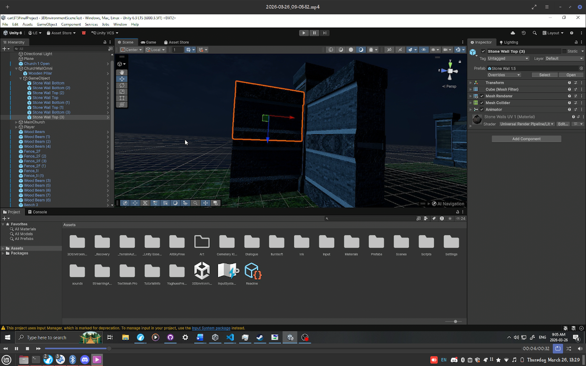

This wall uses a main fence post scaled up by two, with two stone walls.
The top one is rotated 180 degrees on the Y access, basically upside down, so that it forms something continuous-looking. This program is put within an empty object and then moved 5 continuous degrees either within the X or Z axis to form a continuous wall structuring.

This turned out to be a major godsend, since it allowed me to scale to my hearts content, making the mansion as big as I wanted. And the best part was that, after adding in a floor, I was then able to completely copy and paste it twice, putting the structures up by a few degrees on the Y axis to form a 3-story mansion where the entire game would take place, with everything actually looking pretty good in the process!

## Entrance

I knew that I wanted the game to have an intro sequence where we would actually sort of walk into the room, or at least for it to serve as more than just a three story box. I found an archway within its assets that I scaled up by two and used as its walkway, given that there were only two types of doors available, neither of which looked good when given a script to allow them to open. I kept it open, but the geometry was weird, providing little cracks in its corners. That was quickly solved when I found a beam that I scaled down in order to hide it, and that was that!

As a side note, I had to use beams a few times for the first person walking that I was using, in order to actually have you not get stuck on the geometry that you're meant to walk up or down on.

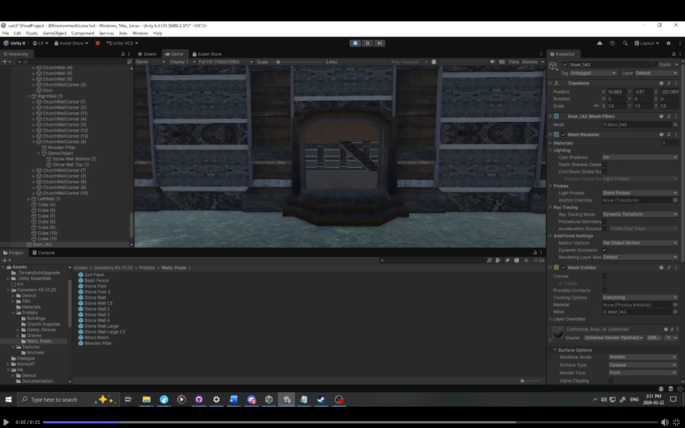

## Stairs

For the stairs going up and down, I found a singular staircase model within the assets (since I really didn't want to have to make my own staircase using repeating beams). It looked fine enough, but presented with its own problems: when staring at it from the back, the texture completely disappears, and when scaled too large, it becomes unclimbable. I solved the first issue with something I learned way back when I was a teenager building large structures in Minecraft: have a stair texture facing opposite direction from it to feel like a repeating structure.

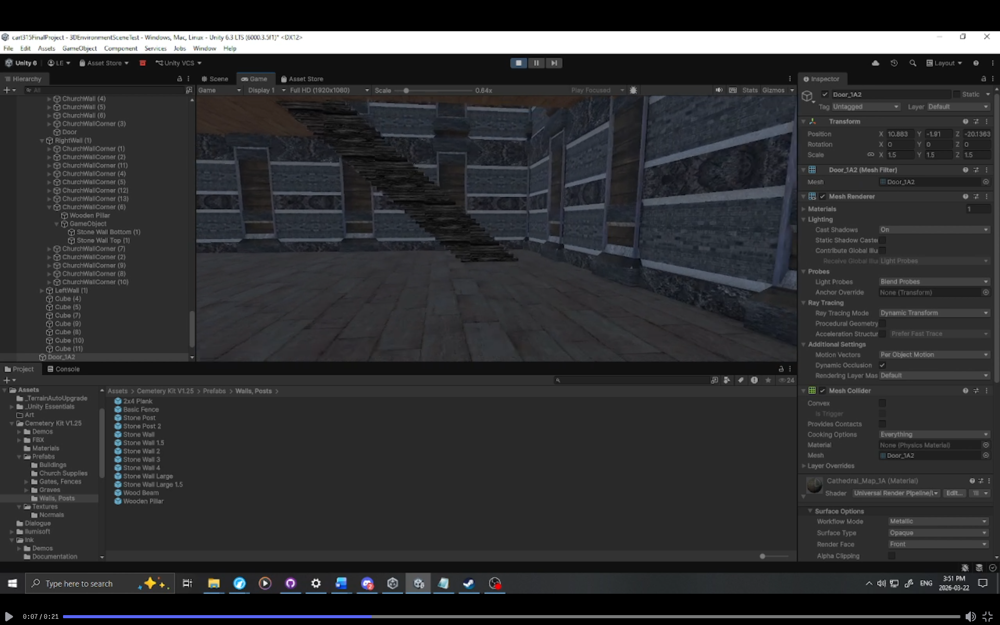

Additionally, for the scaling, I found a good amount that could actually reach the second floor evenly without needing to update my walking script to account for higher elevation. Now, we had something clean.

Another strange issue I had, however, was cutting out the floor to make room for the stairs. I had to split my floor using simple mathematics, making 3 floor textures to cover each part.

Finally, I copied that similar staircase going from the second to the third floor, but that presented an interesting problem of it overshooting the flooring. That was solved, however, by using a common architectural pattern of elevating the landing strip at the top and building a two-step system down to the main floor, making it feel slightly more modern, a welcome addition.

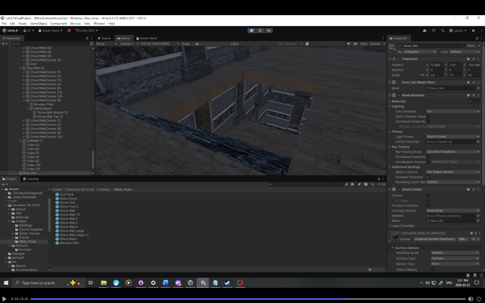

## Fine tuning the floor

Now that I had openings in my floor where you could see stretched texturing, I needed some way to cover it up.

This is where beams, once again, became my best friend. By using them to act as "supports" for the flooring, I could hide away the stretched texturing while adding more personality to the floor. A win win!

## Therapy Room

Now that I had a clean way to get into the mansion and get to all the floors, I now needed our main gimmick: a therapy room.

I simply cut out part of the first floor and extended it out into its own little room, sealing it off and putting a door within (which took another half hour of time to look right).

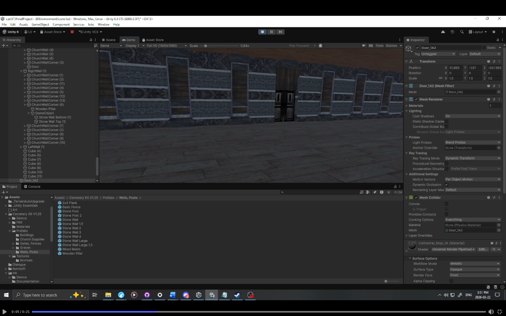

I ended up putting a wood-like texture on top to hide the strange apperature in the wall above the door (which doesn't currently open). Finally, inside, I put two pews, one large and small, alongside a lectern to act as placeholder objects for the therapy couch, the seat you'd be in to initiate the therapy, and the holding place for the diary to be.

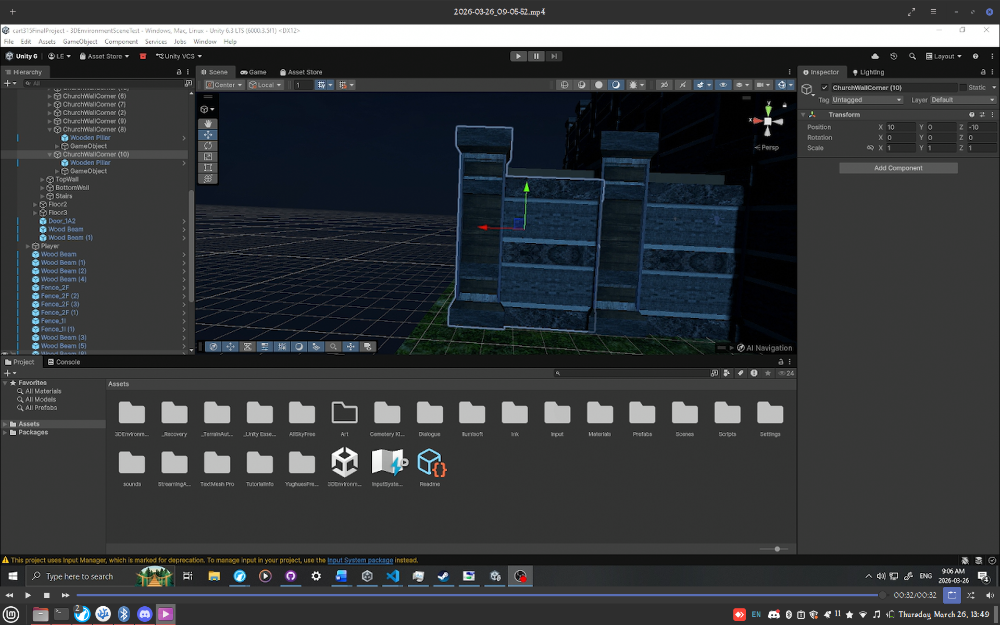

## Optional Balcony

Solely because I thought it would look cool, I decided to have an overhanging balcony on the third floor, hopefully to allow more light in to naturally illuminate the third floor. Plus, I wanted distinction between the second and third floor. I found another fence structure that I used as the railings of the balcony, and simply cut out part of the wall, putting another equal floor to extend outside of the mansion.

## Lighting

I had to look this one up online, but I found a cool asset structure that allowed for 11 different night skies, alongside a tutorial on how to regenerate and bake lighting to not make everything look like you have cat's eye vision. Once I finished with that, everything had a cool stylistic nighttime feel to it. This allowed me to focus a bit of my time on adding in some point lights to artificially illuminate the mansion.

## COQUI AI

Finally, now was the time to implement the AI, after multiple days of constructing this mansion. I had already managed to make AI work on another Unity project, so I knew exactly what to do. I made the folders, made AIManager, imported all 2 gigabytes of the AI TTS folder into my unity project, and tied things together so I would hear "Hello from Unity". This only took 10 minutes, given that I already knew what to do.

However, I wasn't going to end the week just doing that. I wanted to finish with the ability to press E on an "NPC" and for the script to then run and respond back to me.

I followed another tutorial to implement a very basic NPC system where you could press E in a designated area where an asset would sit and it would trigger a script to run. I put a tombstone in place of a character asset and tied everything together, and after 20 seconds of runtime and lots of finnicking around with things, it actually worked! I was able to press E and heard something happen!!

## What's next?

A big thing I want to do next is to actually separate the 20 seconds it takes for the AI to boot up with the 2 seconds it takes to speak. If I can divide that up, to where the AI boots up at launch or even in a loading screen, that would be exactly what I'm looking for. Now that everything in there is done, all that's left is to populate the place with the necessary NPCs, make the door interactible, and decorate the mansion with lights and little knick-knacks. This week has been incredibly productive, and now I have a fancy hand-crafted and structurally solid three-story mansion to call my own!... in Unity.

# Week 10 - April 2, 2026

## Expanding the Environment Scale

This week, a major focus of my work was on significantly expanding the playable environment. Originally, the scene was confined to a relatively small 10x10 area, which felt restrictive and limited in terms of exploration and immersion. I increased the size of the terrain to a much larger 30x30 space, instantly creating a stronger sense of openness. This change allowed for more thoughtful placement of environmental elements and gave the player a better feeling of being situated within a larger world rather than a confined test space. The increased scale also laid the groundwork for more complex level design decisions moving forward.

## Enhancing Atmosphere with Vegetation

After expanding the terrain, I shifted my attention to improving the visual atmosphere of the environment. I explored the available asset library and selected several tree models to populate the area. Using Unity’s terrain tools, I distributed these trees across the landscape in a natural, somewhat uneven pattern to avoid repetition and artificiality. This addition dramatically changed the tone of the environment—what was once a relatively empty space began to feel more abandoned, overgrown, and “lived in.” The density and placement of the trees helped suggest a world that exists beyond the player’s immediate actions, contributing to environmental storytelling.

For this, I used 3 different trees from an available asset on the Unity store.

## Removing Placeholder Structures

As part of refining the scene, I removed the pre-set mansion that had previously been used as a placeholder reference. While it was helpful during early prototyping, it no longer aligned with the direction I wanted for the environment. Removing it allowed me to rethink the layout and flow of the space without being constrained by temporary assets. This step marked a transition from rough prototyping toward a more intentional and polished design.

## Guiding the Player with Environmental Design

To help direct the player’s movement and make the objective clearer, I introduced several guiding elements into the environment. I added a fence that acts as both a visual boundary and a subtle gameplay cue, suggesting a path the player is meant to follow or pass through. In addition, I created a defined pathway leading toward the intended destination. These elements work together to naturally guide the player without relying on explicit instructions or UI markers.

## Using Lighting to Reinforce Direction

Lighting played an important role in strengthening player guidance. I added two strong spotlights: one directed toward the player’s starting position and another aimed toward the mansion area (or intended focal point). These lights serve as visual anchors, drawing the player’s attention and reinforcing the direction they should move in. By combining lighting with environmental cues like the path and fence, I was able to create a clearer and more intuitive navigation experience.

## Creating a Sense of World Boundaries

Finally, I used Unity’s terrain sculpting tools to build up mountains and elevated landscapes around the outer edges of the map. This was an important step in making the environment feel complete and grounded. Without these boundaries, the terrain risked feeling like a floating platform or an unfinished space. The addition of mountains helped enclose the environment in a natural way, giving the impression that the playable area exists within a larger world. It also subtly prevents the player from straying too far off course while maintaining immersion.

## Reflection on Progress

Overall, this week’s work focused on transforming the environment from a basic prototype into a more immersive and intentional space. By expanding the terrain, adding vegetation, refining structures, and using lighting and terrain design strategically, I was able to create a stronger sense of atmosphere and direction. These changes not only improve the visual quality of the scene but also enhance the player’s experience by making the world feel more believable and easier to navigate.